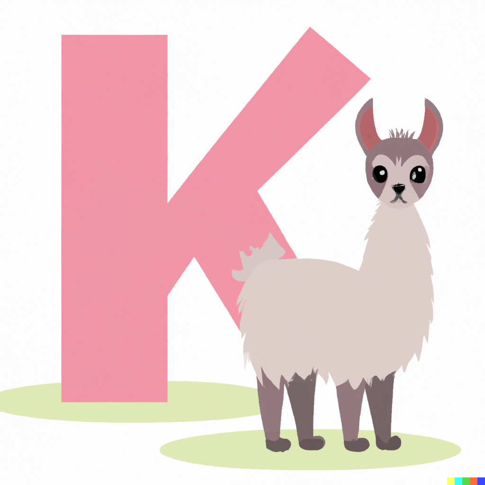
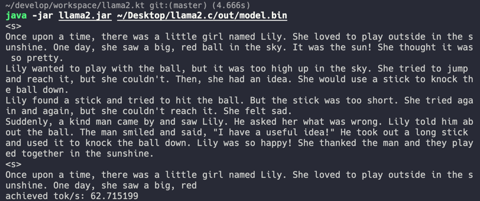

# llama2.kt



这是 [Andrej Karpathy](https://karpathy.ai/) 的 [llama2.c](https://github.com/karpathy/llama2.c) 项目的 Kotlin 实现版本。

## 如何运行



### 通过命令行

1. 将 `Llama2.kt` 编译 jar 包;

```shell
kotlinc src/main/kotlin/Llama2.kt -include-runtime -d Llama2.jar
```
2. 使用 `java -jar` 命令执行生的 jar 文件，需要传入必须的 `checkpoint` 路径；

```shell
java -jar Llama2.jar /path/to/model.bin
```

除了 `checkpoint` 之外，还支持其他的参数，如下：

```shell
java -jar llama2.jar /path/to/model.bin 0.9 256 "One day, Lily met a Shoggoth"
```
参数说明:
- `/path/to/model.bin`：必须的模型文件路径。
- `0.9`：可选参数，设置阈值，默认为1.0。
- `256`：可选参数，设置缓存大小，默认为512。
- `One day, Lily met a Shoggoth`: 可选参数，设置生成故事的 Prompt。

输出内容如下：

>Once upon a time, there was a little girl named Lily. She loved to play outside in the sunshine. One day, she saw a big, red ball in the sky. It was the sun! She thought it was so pretty.
Lily wanted to play with the ball, but it was too high up in the sky. She tried to jump and reach it, but she couldn't. Then, she had an idea. She would use a stick to knock the ball down.
Lily found a stick and tried to hit the ball. But the stick was too short. She tried again and again, but she couldn't reach it. She felt sad.
Suddenly, a kind man came by and saw Lily. He asked her what was wrong. Lily told him about the ball. The man smiled and said, "I have a useful idea!" He took out a long stick and used it to knock the ball down. Lily was so happy! She thanked the man and they played together in the sunshine.
>
>Once upon a time, there was a little girl named Lily. She loved to play outside in the sunshine. One day, she saw a big, red
>
> achieved tok/s: 68.054444

### 通过 Gradle

另外，你也可以使用 gradle task 的方式来生成 jar 包并执行，如下方式：

```shell
./gradlew completion -Pcp="/path/to/model.bin"
```

## 运行性能数据

以下数据都是基于 Macbook Pro 2019(2.3 GHz 八核Intel Core i9) 测试，未做严谨的性能测试，所以在实际运行中可能会存在数据波动。

### Llama2.c

使用 `gcc -o run run.c -lm` 进行编译、测试。数据如下：

|           | parameters                                                   | tok/s |
|-----------| ------------------------------------------------------------ | ----- |
| Llama2.c  | [stories15M.bin](https://huggingface.co/karpathy/tinyllamas/resolve/main/stories15M.bin) | 26    |
| Llama2.c  | [stories42M.bin](https://huggingface.co/karpathy/tinyllamas/resolve/main/stories42M.bin) | 9     |
| Llama2.c  | [stories110M.bin](https://huggingface.co/karpathy/tinyllamas/resolve/main/stories110M.bin) | 3     |


### Llama2.kt


|           | parameters                                                   | tok/s |
|-----------| ------------------------------------------------------------ | ----- |
| Llama2.kt | [stories15M.bin](https://huggingface.co/karpathy/tinyllamas/resolve/main/stories15M.bin) | 61    |
| Llama2.kt | [stories42M.bin](https://huggingface.co/karpathy/tinyllamas/resolve/main/stories42M.bin) | 22    |
| Llama2.kt | [stories110M.bin](https://huggingface.co/karpathy/tinyllamas/resolve/main/stories110M.bin) | 8     |


