# 如何调试评估模型？

## 1 背景

上文 ([Llama2.c（2）: 如何训练模型？](train.md)) 中展示了多个模型（6 个）直接的性能数据对比，但其实真正训练了 20+ ，而最终用来分析对比的只有 6 个。因为，模型训练的过程中会有一些详细信息没有被记录下来，导致想要整理上述的信息时需要从头开始在训练一次，非常的耗时且不容易被追踪，导致问题的排查将会变得异常艰难。

后来发现：

1. Llama2.c 项目中使用了 `wandb` 来记录训练过程中的一下参数信息。

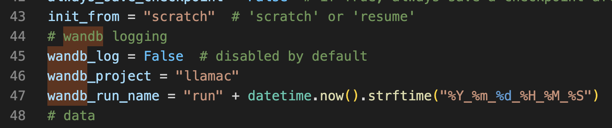

1. 吴恩达和 W&B 联合推出了 [Evaluating and Debugging Generative AI](https://www.deeplearning.ai/short-courses/evaluating-debugging-generative-ai/) 短期课程。


1. OpenAI 官网中的 **[Fine-tuning](https://platform.openai.com/docs/guides/fine-tuning/fine-tuning)** 的部分也提到了可以使用 W&B 来追踪微调的一下性能数据。

上述内容都提到了 `Weights & Biases` 开发的 `wandb` 库，它可以非常轻松的管理模型训练中的一些数据，并且在 H5 中提供了一些实用的功能，以及同模型之间的对比。下面我们就一起看一下 `wandb` 库的一些用法。

## 2 如何使用 `wandb`

`wandb` 库使用起来也是非常简单的，可以把它简单理解为一个“打点/统计库”，记录我们模型训练中的一些指标，指标分为系统指标（比如网络情况、CPU 使用情况）和自定义指标（比如训练中的 loss、branch size 等信息）。

一个完整的 `wandb` 库使用步骤如下：

1. 使用 `wandb.login()` 进行初始化，确保数据会上传到正确的账号下；
2. 使用 `wandb.init()` 开始自定义记录数据；
3. 使用 `wandb.log() ` 记录数据；
4. 使用 `wandb.finish()` 结束记录数据；

大致的代码逻辑如下：

```python
import wandb

# post
wandb.login(key="02081c687f5e8b813e0e2d5a90cd34b4fa444468")

# 2. 开始记录数据
wandb.init(project='mediapipe', name="v3", config=train_config)


# 3. 使用 W&B 记录数据
wandb.log({
            'train_loss': step_loss,
            'train_accuracy': step_accuracy,
            'train_precision': step_precision,
            'train_recall': step_recall
            })

# 4. 结束记录数据
wandb.finish()
```

其中 log 函数的 API 参数非常丰富，支持的功能也非常多，后面会逐步展开。下面就看下 Llama2.c 项目中具体是如何使用 wandb 的。

## 3 Llama2.c 项目中是如何使用的

### 3.1 初始化

首先项目中是默认是关闭 wandb 功能的，想要开启需要讲训练脚本中的 `wandb_log` 变量设置为 True。代码如下：

```shell
# wandb logging
wandb_log = True  # disabled by default
wandb_project = "llamac"
wandb_run_name = "run" + datetime.now().strftime("%Y_%m_%d_%H_%M_%S")
```

在项目正式开始训练的时候，会进行初始化操作，代码如下：

```shell
# logging
if wandb_log and master_process:
    import wandb
    wandb.init(project=wandb_project, name=wandb_run_name, config=config)
```

其中 config 就是一个字典，包含训练时的各种参数信息，这部分信息上传后在 `W&B` 的后台中找到对应的 run ，在 `overview` tab 中的效果如下：

|overview|config|
|---|:---:|
| 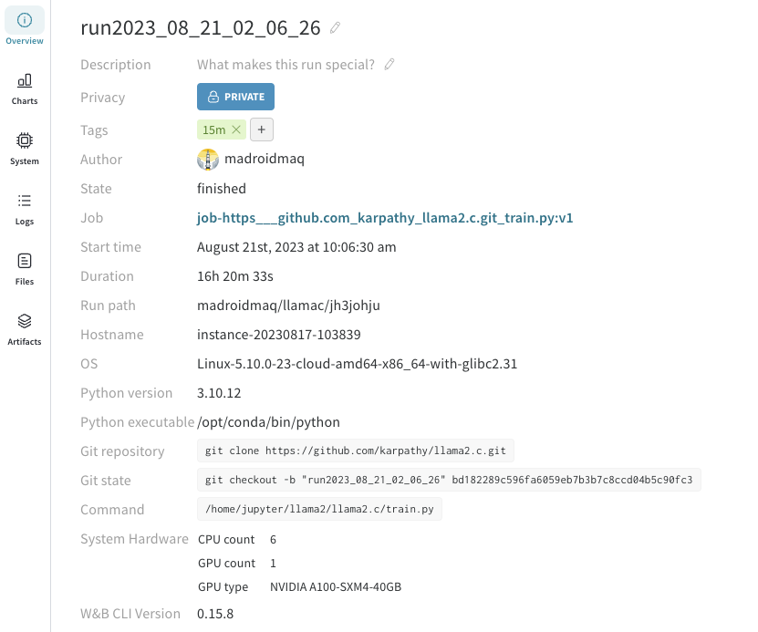 | 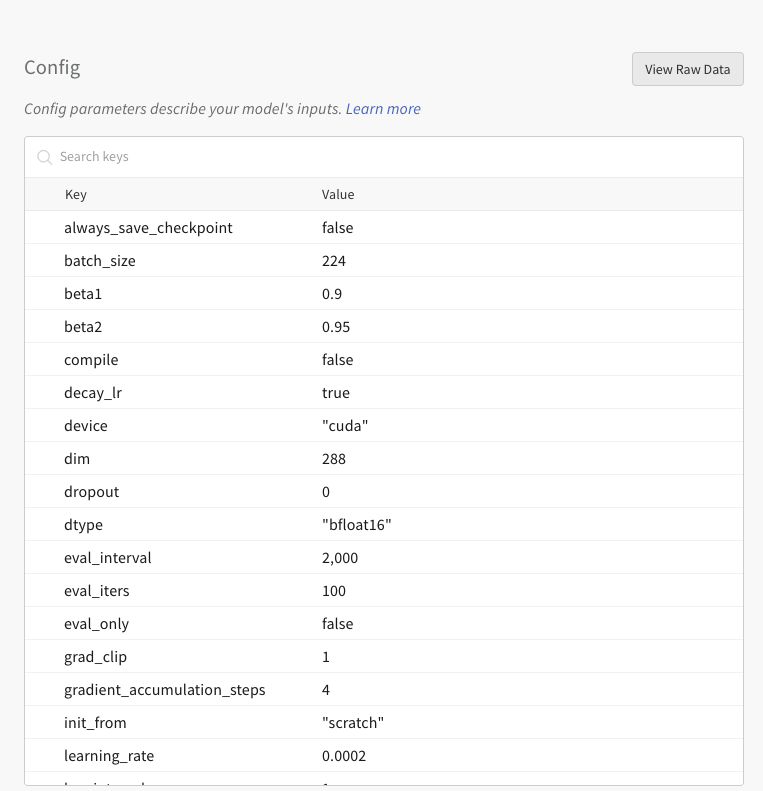 |

### 3.2 信息记录

`init` 完成之后，就会在对应的训练过程中记录下相关的一些细节信息了，项目中记录的信息有迭代次数、消耗的 token 数、loss 等信息，代码如下：

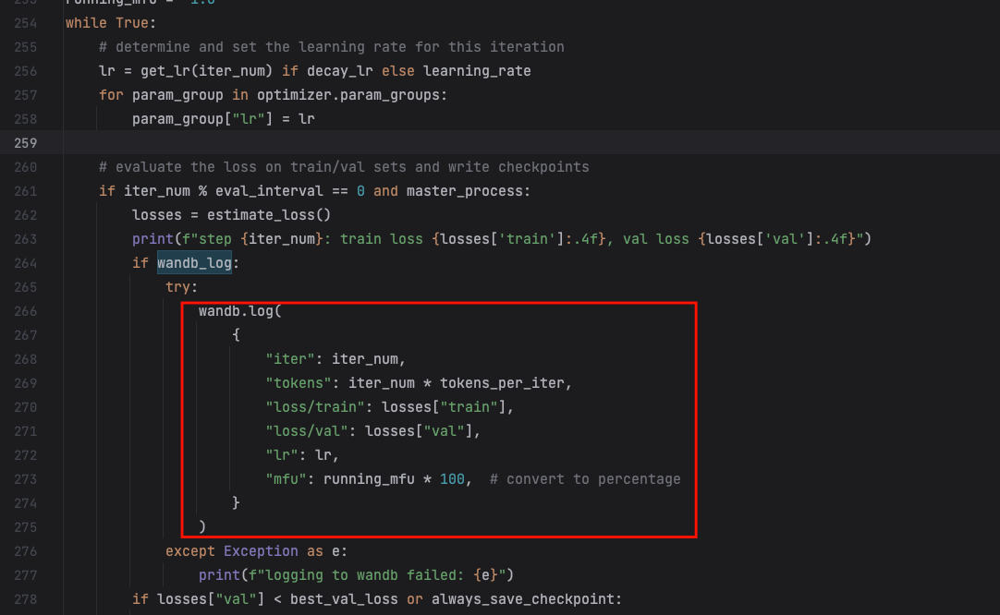

项目代码中有一个控制记录频率的控制逻辑，可以是每个批次的训练都记录，也可以指定训练多少次之后再记录。这些记录的数据都可以在 `W&B` 后台中进行查看，下面就看一下后台是如何展示这些数据的。

### 3.3 日志查看

等执行到 wandb 进行初始化的时候，会有一些详细的日志输出，方便我们查看相关的一些细节信息。如果是首次运行的话，会让输入账号对应的 api key 信息，之后所有的信息都会上传到对应的账号中，当然也可以选择一些本地模式，这样就看不到丰富的图表信息了。下面是初始化时的一些信息输出：

```plain text
using fused AdamW: True
wandb: (1) Create a W&B account
wandb: (2) Use an existing W&B account
wandb: (3) Don't visualize my results
wandb: Enter your choice: 2
wandb: You chose 'Use an existing W&B account'
wandb: Logging into wandb.ai. (Learn how to deploy a W&B server locally: https://wandb.me/wandb-server)
wandb: You can find your API key in your browser here: https://wandb.ai/authorize
wandb: Paste an API key from your profile and hit enter, or press ctrl+c to quit: 
wandb: Appending key for api.wandb.ai to your netrc file: /home/jupyter/.netrc
wandb: Tracking run with wandb version 0.15.8
wandb: Run data is saved locally in /home/jupyter/llama2/llama2.c/wandb/run-20230820_171501-3mhegtm8
wandb: Run `wandb offline` to turn off syncing.
wandb: Syncing run run2023_08_20_17_14_49
wandb: ⭐️ View project at https://wandb.ai/madroidmaq/llamac
wandb: 🚀 View run at https://wandb.ai/madroidmaq/llamac/runs/3mhegtm8
```

在项目运行完成之后，也会根据 log 中的信息，给出一些趋势和统计信息，如下信息输出，迭代了 2200 次，训练时的 loss 最终为 0.84551，训练一共使用了 2883584000 个 token。

```plain text
wandb: Waiting for W&B process to finish... (failed 255). Press Control-C to abort syncing.
wandb: 
wandb: Run history:
wandb:       iter ▁▂▂▃▄▄▅▅▆▇▇█
wandb: loss/train █▁▁▁▁▁▁▁▁▁▁▁
wandb:   loss/val █▁▁▁▁▁▁▁▁▁▁▁
wandb:         lr ▁█████████▇▇
wandb:        mfu ▁███████████
wandb:     tokens ▁▂▂▃▄▄▅▅▆▇▇█
wandb: 
wandb: Run summary:
wandb:       iter 22000
wandb: loss/train 0.84551
wandb:   loss/val 0.87666
wandb:         lr 0.00018
wandb:        mfu 24.40922
wandb:     tokens 2883584000
wandb: 
wandb: 🚀 View run run2023_08_20_17_14_49 at: https://wandb.ai/madroidmaq/llamac/runs/3mhegtm8
wandb: ️⚡ View job at https://wandb.ai/madroidmaq/llamac/jobs/QXJ0aWZhY3RDb2xsZWN0aW9uOjkxNjUzMjMy/version_details/v1
wandb: Synced 6 W&B file(s), 0 media file(s), 2 artifact file(s) and 0 other file(s)
wandb: Find logs at: ./wandb/run-20230820_171501-3mhegtm8/logs
```

除了日志信息输出为，`W&B` 提供了 H5 页面来展示这些数据。

## 4 `W&B` 后台展示初探

### 4.1 `Overview`

每个任务（`run`）都会有一个单独的空间展示当词运行的一些信息，如下 `Overview`  tab 下展示的一些汇总信息，除了之前展示的 Config 信息之外，还会将 log 中记录的信息进行汇总形成 summary 信息，如下图：

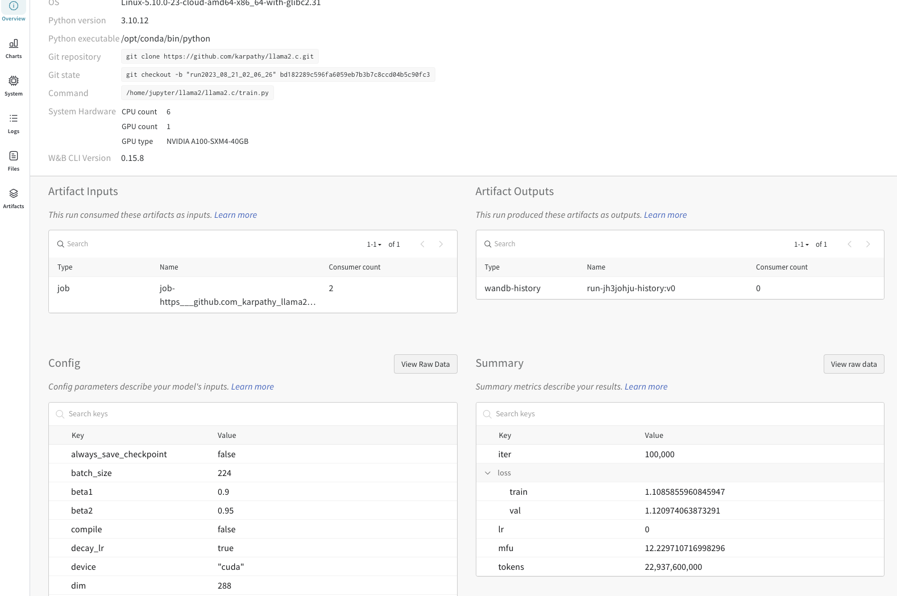

### 4.2 `Charts`

`Charts`  tab 会展示 log 中每个参数根据步数的变化情况，如下可以很清晰的看到变化的趋势。

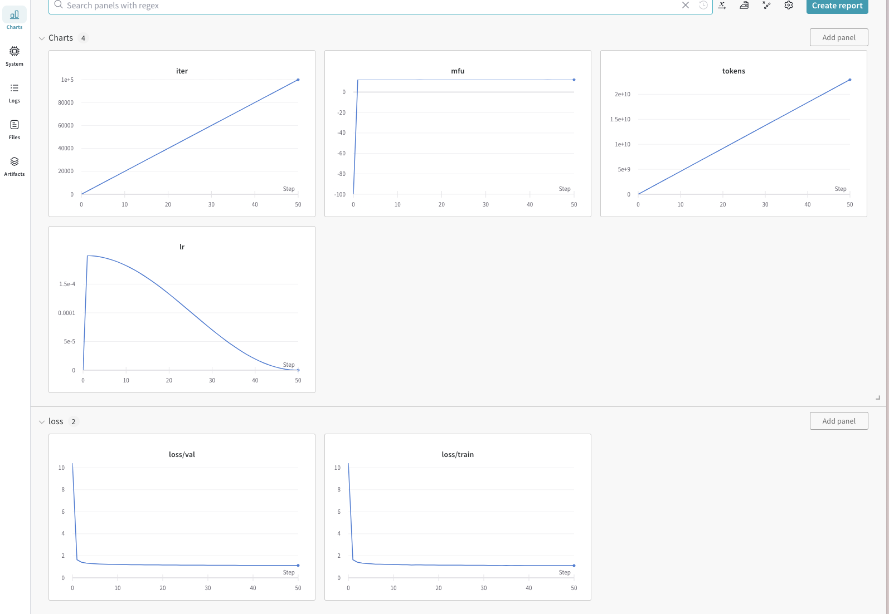

### 4.3 `System`

`System` 中会展示 wandb 默认收集到的一些系统信息，如 cpu、gpu、内存、网络的信息，展示如下：

|系统信息|训练信息|
|---|:---:|
| 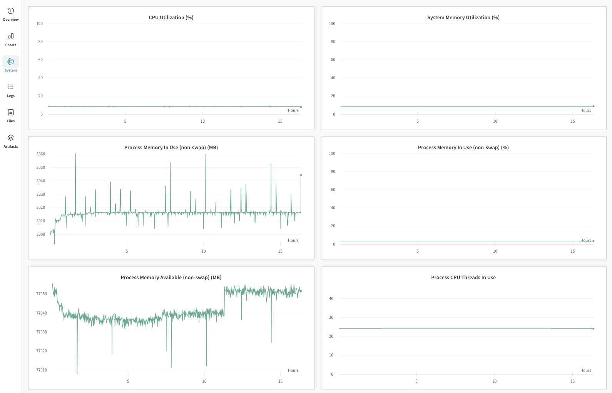 | 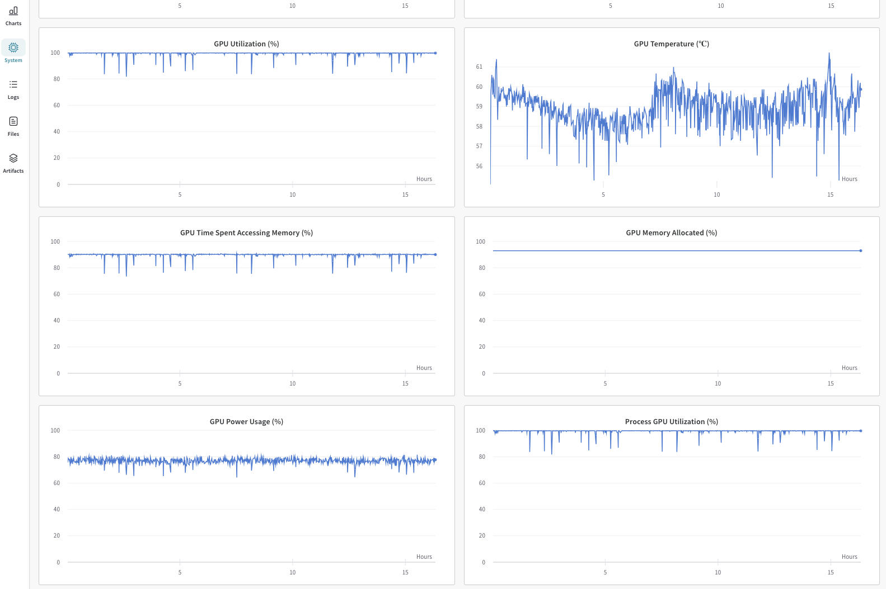 |

### 4.4 `Logs`

`Logs` tab 中展示的是终端中输出的具体信息：

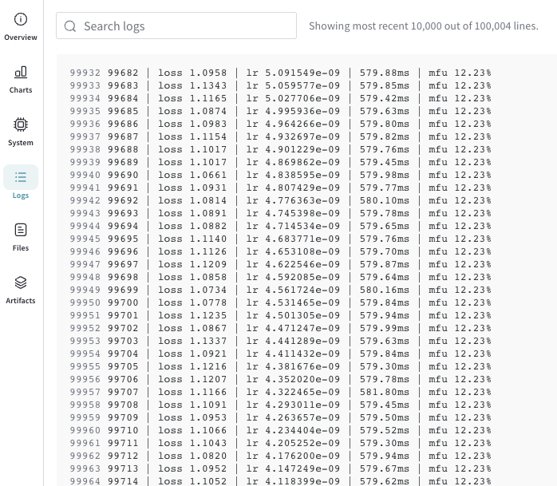

除了上述的内容之外，还有 `Files` 和 `Artifacts`  ，这里下文在展开。

上述的内容基本都是单词运用的结果汇总，真实开发中我我往往需要对比多次运行的结果，从中找到不同参数对结果的不同影响。

### 4.5 对比多次运行结果

下图中就是展示了 4 次运行数据的对比情况，可以在一张图表中查看同一参数的变化情况。

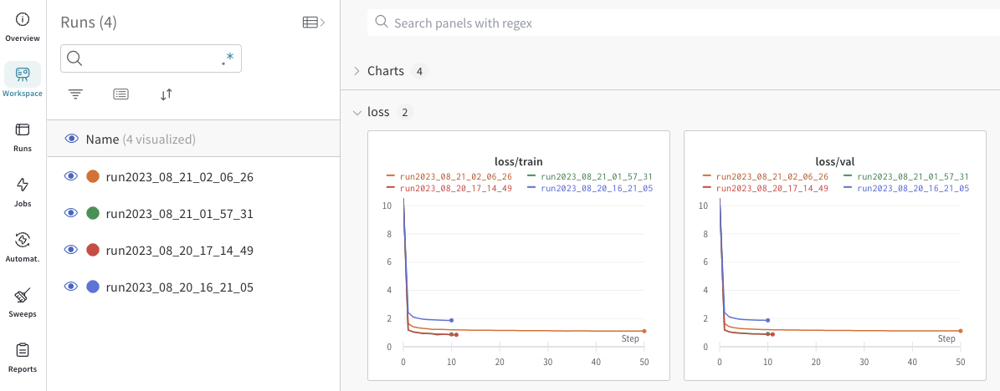

也可以使用表格的形式展示每次运行的不同结果，如下：

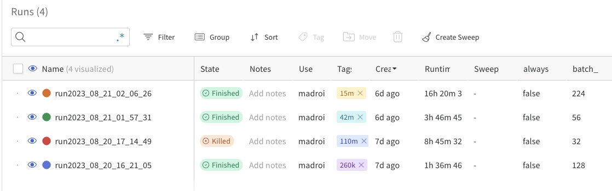

### 4.6 自定义图表

上午中提到，由于我们训练的 batch size 不同，每一步的训练的 token 数并不相同，绘制 token 于 loss 变化趋势更能反应出模型在训练中的变化情况。这种情况下就需要使用自定义图表来实现了，这部分也是非常的简单，直接在后台进行操作即可。我们将 X 轴设置为 Token，Y 轴设置为 Loss 即可，如下：

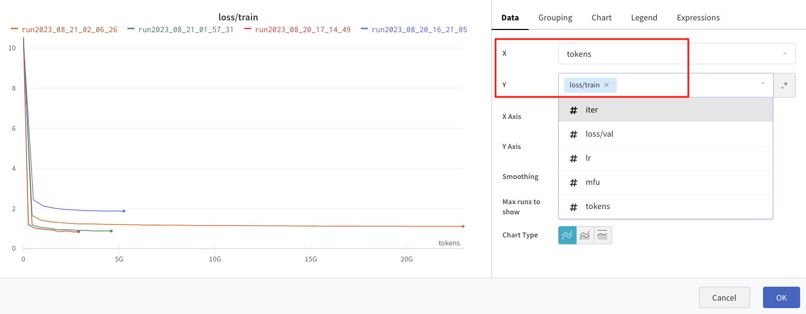

这样我们在首页就可以同时看到 Step 和 Token 对训练 Loss 的影响了，如下：

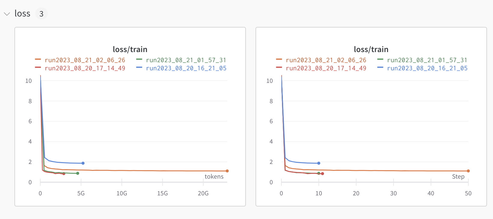

## 5 `MediaPipe` 项目案例：文本分类模型

我们以使用 Google 的 `MediaPipe` 框架训练一个文本分类模型为例，看看如何使用 `wandb`。

### 5.1 问题

 `MediaPipe` 框架内部封装使用了 `keras` 框架模型训练相关的逻辑，对使用者而言更加简单，同时也丧失了灵活性。

llama2.c 项目中直接使用了 `pytorch` 进行训练，每一步训练中的参数信息（loss 等）都可以直接获取，从而记录下来。而 `MediaPipe` 中只有一些日志的打印，没有相关的 API 可以获取到训练中的一些详细内容，所以如何上传这部分的内容也成为了一个难点。

其实 `keras` 库中有设置相应 callback 监听训练中信息的 API，查看 `MediaPipe` 相关源码，发现 `model_utils` 中仅有内置的一些默认 callback ，并没有设置的方法。

```python
def get_default_callbacks(
    export_dir: str) -> Sequence[tf.keras.callbacks.Callback]:
  """Gets default callbacks."""
  summary_dir = os.path.join(export_dir, 'summaries')
  summary_callback = tf.keras.callbacks.TensorBoard(summary_dir)

  checkpoint_path = os.path.join(export_dir, 'checkpoint')
  checkpoint_callback = tf.keras.callbacks.ModelCheckpoint(
      os.path.join(checkpoint_path, 'model-{epoch:04d}'),
      save_weights_only=True,
      period=5)
  return [summary_callback, checkpoint_callback]
```

在 `MediaPipe` 中使用 MobileBert 进行训练时，会使用上述默认的 Callback，代码逻辑如下：

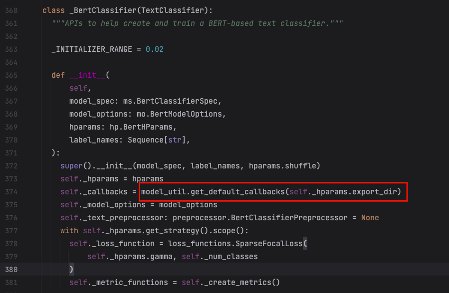

### 5.2 监听系统输出进行拦截

虽然没有直接可用的 API 获取到对应的信息，但是我们可以使用一种 hook 的方式，因为模型在训练的过程中会向终端中打印日志，如果我们能拿到这部分的文本对其进行解析话就可以上传这部分训练数据。

训练过程中的日志输出大致如下：

```python
Epoch 1/2
...

172/199 [========================>.....] - ETA: 57s - loss: 0.6265 - accuracy: 0.7052 - precision: 0.9647 - recall: 0.9766"
...
199/199 [==============================] - 453s 2s/step - loss: 0.6087 - accuracy: 0.7101 - precision: 0.9631 - recall: 0.9765 - val_loss: 0.4194 - val_accuracy: 0.8072 - val_precision: 0.9707 - val_recall: 0.9872
...
```

拦截日志输出的代码逻辑大致如下：

```python
		# 设置拦截器
    original_stdout = sys.stdout
    sys.stdout = StdoutRedirect(original_stdout)

		# 训练模型 。。。

		# 复原
    sys.stdout = original_stdout
```

其中 `StdoutRedirect` 类中，解析训练中每一步日志的大致逻辑如下：

```python
def parse_steps(self, text):
        try:
            step_loss = self.get_value_after_keyword("loss:", text)
            step_accuracy = self.get_value_after_keyword("accuracy:", text)
            step_precision = self.get_value_after_keyword("precision:", text)
            step_recall = self.get_value_after_keyword("recall:", text)

            metrics = {
                # 'epoch': self.epoch,
                'train_loss': step_loss,
                'train_accuracy': step_accuracy,
                'train_precision': step_precision,
                'train_recall': step_recall
            }

            # 使用 W&B 记录数据
            wandb.log(metrics)
            return metrics
        except Exception as error:
            self.original_stdout.write(f"\nError IndexError: {error}")
            self.original_stdout.flush()
            return None
```

其他的解析逻辑类似，这里就不在赘述了。拦截日志的方式虽然可以记录对应的信息，但是其扩展性几乎没有，并不是好的结局方案，但是能用。虽然拦截日志的方式并不可取，但是我们仍然可以加入一些设计（良好的类的设计）让其不回影响到其他的逻辑。

通过上述的代码逻辑，我们可以很好的追逐模型训练过程的一些参数变化情况，最终 Flex 模型训练的数据如下，通过下图可以很好的对比两个数据集对模型质量的影响情况。

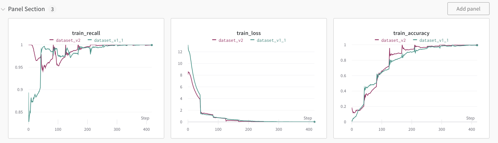

### 5.3 使用 File 记录模型文件

模型训练的完成之后，会导出需要做手机上运行的 tflite 模型文件。`wandb` 也支持这种需求，而且可以将模型文件和训练的详情关联起来，方便追踪训练的细节信息，对应的代码如下：

```python
def _upload_tf_model(self, file):
        # 创建一个 WandB Artifact
        artifact = wandb.Artifact(
            name="tflite_model",
            type="model",
            description="A simple model",
            metadata={"framework": "tensorflow", "model_type": "Sequential"}
        )
        # 将模型文件添加到 Artifact
        artifact.add_file(file)
        # 上传 Artifact 到 WandB
        wandb.log_artifact(artifact)
```

在项目页面中展示的效果如下：

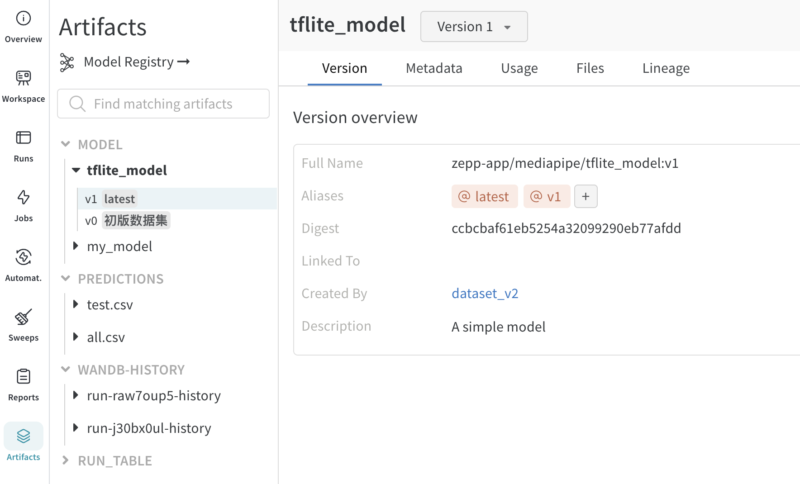

### 5.4 使用 Table 进行记录

模型训练完成之后，需要测试模型对每个指令的识别情况，从而可以进一步追踪和优化训练过程，或是调整数据集。所以这个过程中，我们就需要模型对测试集中每一个输入的识别情况，在这个场景下使用 `wandb` 的 log 函数并不能很好的展示这部分的数据，`wandb` 中提供了表格的数据形式，我们可以使用这个信息记录下每个文本被识别成的指令，当前指令的概率等信息，代码大致如下：

对应的代码如下：

```python
def upload_test_table(self):
        data = self.results_data
        true_labels = data['successful'].tolist()
        expected_labels = data['expected'].tolist()
        predicted_labels = data['actual'].tolist()
        scores_labels = data['score'].tolist()
        prompts_labels = data['prompt'].tolist()

        table = wandb.Table(columns=["Successful", "Expected", "Actual", "Score", "Prompt"])
        for true_label, expected_label, pred_label, score_labels, prompt in zip(true_labels, expected_labels,
                                                                                predicted_labels,
                                                                                scores_labels, prompts_labels):
            table.add_data(true_label, expected_label, pred_label, score_labels, prompt)

        wandb.log({f"{self.tag}_test": table})
```

在后台中展示的效果如下：

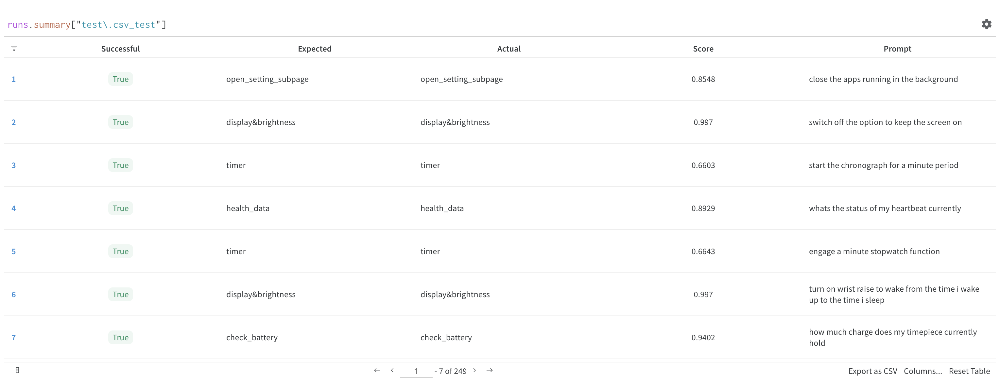

在指令识别过程中，就算是一个分类可以被 100% 的命中，也不能说明模型对期望类型的学习以及足够，因为是否时被命中分类是选取的概率最高的一个类别，这个类别的概率最高但是其真实值可能会很低。我的使用得分进行排序后进行查看，下图中的两个数据可以很好的说明这个问题。

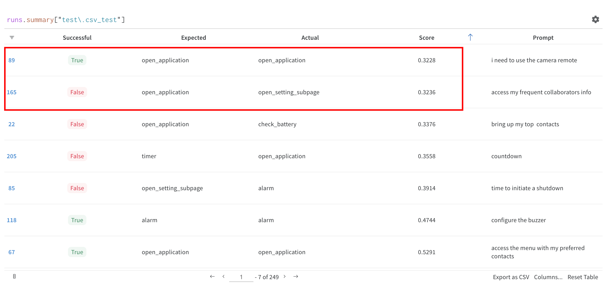

### 5.5 混淆矩阵

在多指令分类业务场景中，混淆矩阵是一个很经典图可以快速查看每个分类的准确性，以及识别错误类别的分布情况，`wandb` 也是支持这种图表的。对应的代码如下：

```python
def upload_matrix(self):
        data = self.results_data
        class_names = ["open_setting_subpage", "open_application", "stopwatch", "volume",
                       "health_data", "check_battery", "chat", "introduction",
                       "display&brightness", "alarm", "timer", "calendar"
                       ]
        label_to_index = {label: index for index, label in enumerate(class_names)}

        # 将字符串标签转换为其对应的索引
        true_labels = data['expected'].map(label_to_index).tolist()
        predicted_labels = data['actual'].map(label_to_index).tolist()

        wandb.log({f"{self.tag}_confusion_matrix": wandb.plot.confusion_matrix(
            y_true=true_labels,
            preds=predicted_labels,
            class_names=class_names)})
```

在后台中绘制出的图表如下：

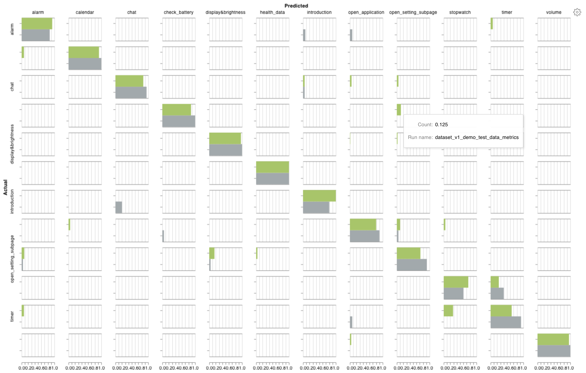

通过上图可以很直观的看出每个具体类别上准确率情况，识别错的分类也可以很方便看出是落到哪些类别上了。

## 6 总结

`W&B` 开发的 `wandb` 库可以非常简单的对模型进行调试和评估。在模型的训练前、训练中、训练后等环节中都可以提供多方位支持。

- 训练前：支持训练参数的记录于同步；
- 训练中：支持记录系统信息（GPU、CPU 等）以及训练信息（Loss 等）；
- 训练后：上传模型文件，上传模型预测结果等；

这些过程中提供了大量的可视化图表，对于查看各个指标的变化趋势有非常大的帮助。由于篇幅原因，并未枚举出 `W&B` 的所有功能，更多的详细内容，可以见 [官方文档](https://docs.wandb.ai/guides)。
