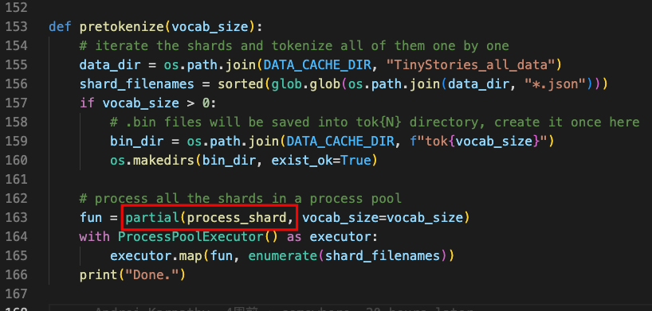

# 如何训练模型？

关键点：

1. TinyStories 数据集是由 GPT3.5/4 生成的针对 3-4 岁儿童的故事文本；
2. Llama2.c 项目提供完整训练 Llama2 模型的代码，可以添加自己的数据集进行训练；
3. 目前已经复现了项目中的 4 个模型参数（260k/15M/42M/110M）的训练过程，训练代码会存在过拟合的现象；
4. 目前看，110M 模型 Loss 最小，42M 的模型整体来看效果最优；

## 1 背景

书接上文 [Llama2.c - 项目介绍](https://zepp.feishu.cn/docx/DgzwdpAQcoafSixHMk8cEWudnFh)，介绍了项目的一些基本情况：

1. 如何编译项目，并且加载训练好的模型进行推理；
2. 提供了一些周边相关的学习资源；

本文将主要讲解如何基于项目从零开始训练一个生成故事的语言模型。

## 2 TinyStories 数据集简介

项目中默认是使用 <u>[TinyStories](https://huggingface.co/datasets/roneneldan/TinyStories)</u>  数据集进行训练，该数据集主要是一些适合 3 - 4 岁儿童故事的文本内容，由 GPT3.5/4.0 生成。数据集中大约有 **200 万**+ 个故事，其中：

- 训令集：2.12M rows
- 验证集：22k rows

数据集中每一条的数据格式大致如下：

```json
{
    "story": "Once upon a time, there was a little girl named Lily. She loved to play hide and seek with her friends. One sunny day, Lily and her friends went outside to play.\nIt was Lily's turn to hide. She found a big tree and hid behind it. She waited for a long time, but her friends could not find her. Lily began to feel upset.\nFinally, her friends found her behind the tree. They were all happy to see her. Lily was not upset anymore. They all laughed and played hide and seek until it was time to go home.",
    "instruction": {
        "prompt:": "Write a short story (3-5 paragraphs) which only uses very simple words that a 3 year old child would understand. The story should use the verb \"hide\", the noun \"time\" and the adjective \"upset\". Remember to only use simple words!",
        "words": [
            "hide",
            "time",
            "upset"
        ],
        "features": []
    },
    "summary": "Lily played hide and seek with her friends and hid behind a tree, but her friends couldn't find her. They eventually found her and they all continued to play happily.",
    "source": "GPT-4"
}

```

需要我们进行训练的故事文本为 `story` 字段，如下：

> Once upon a time, there was a little girl named Lily. She loved to play hide and seek with her friends. One sunny day, Lily and her friends went outside to play.\nIt was Lily's turn to hide. She found a big tree and hid behind it. She waited for a long time, but her friends could not find her. Lily began to feel upset.\nFinally, her friends found her behind the tree. They were all happy to see her. Lily was not upset anymore. They all laughed and played hide and seek until it was time to go home.

相关论文见：[TinyStories: How Small Can Language Models Be and Still Speak Coherent English?](https://huggingface.co/papers/2305.07759)

## 3 模型训练步骤

我们使用 [TinyStories](https://huggingface.co/datasets/roneneldan/TinyStories) 数据集来复现项目中的训练过程。主要有以下的几个步骤

1. 下载数据集：这一步比较简单，基本不会遇到问题；
2. 数据集预处理：需要根据自己的机器情况调整 pin_memory 的状态；
3. 训练模型：需要根据自己的机器情况，调整训练的 batch size 、device type（cpu or gpu）、学习率等内容；

我训练的机器配置如下为：

> PyTorch:2.0Optimized: 1 NVIDIA Tesla A100 GPU, 12 vCPUs, 85GB RAMNVIDIA A100 x 1

### 3.1 下载数据集

执行代码的代码下载数据集：

```kotlin
python tinystories.py download
```

对应的输出结果为：

```plain text
(base) jupyter@umn-20230612-000220:~/llama2/llama2.c$ python tinystories.py download
Downloading https://huggingface.co/datasets/roneneldan/TinyStories/resolve/main/TinyStories_all_data.tar.gz to data/TinyStories_all_data.tar.gz...
data/TinyStories_all_data.tar.gz: 100%|█████████████████████████████████████| 1.50G/1.50G [00:13<00:00, 117MiB/s]
Unpacking data/TinyStories_all_data.tar.gz...
Download done.
Number of shards: 50
Example story:
{'story': '\n\nLily and Ben are friends. They like to play in the park. One day, they see a big tree with a swing. Lily wants to try the swing. She runs to the tree and climbs on the swing.\n"Push me, Ben!" she says. Ben pushes her gently. Lily feels happy. She swings higher and higher. She laughs and shouts.\nBen watches Lily. He thinks she is cute. He wants to swing too. He waits for Lily to stop. But Lily does not stop. She swings faster and faster. She is having too much fun.\n"Can I swing too, Lily?" Ben asks. Lily does not hear him. She is too busy swinging. Ben feels sad. He walks away.\nLily swings so high that she loses her grip. She falls off the swing. She lands on the ground. She hurts her foot. She cries.\n"Ow, ow, ow!" she says. She looks for Ben. She wants him to help her. But Ben is not there. He is gone.\nLily feels sorry. She wishes she had shared the swing with Ben. She wishes he was there to hug her. She limps to the tree. She sees something hanging from a branch. It is Ben\'s hat. He left it for her.\nLily smiles. She thinks Ben is nice. She puts on his hat. She hopes he will come back. She wants to say sorry. She wants to be friends again.', 'instruction': {'prompt:': 'Write a short story (3-5 paragraphs) which only uses very simple words that a 3 year old child would understand. The story should use the verb "hang", the noun "foot" and the adjective "cute". The story has the following features: the story should contain at least one dialogue. Remember to only use simple words!\n\nPossible story:', 'words': ['hang', 'foot', 'cute'], 'features': ['Dialogue']}, 'summary': 'Lily and Ben play in the park and Lily gets too caught up in swinging, causing Ben to leave. Lily falls off the swing and hurts herself, but Ben leaves his hat for her as a kind gesture.', 'source': 'GPT-4'}

```

这一步会将数据集处理成 JSON 的格式，并放在 TinyStories_all_data 目录下。

### 3.2 数据集预处理

因为模型训练的过程中，并不是直接训练纯文本内容，而是将所有需要训练的文本转换成对应的 token 之后才能开始训练。所以可以先对数据集进行一个预处理，后续多次训练的时候不用频繁处理 Tokne 化的耗时操作。根据自己的机器情况，这一步可能会比较慢一些。

执行下面的代码即可：

```plain text
python tinystories.py pretokenize
```

之后，终端中会输出对应的转化进度，如下图：


整个过程的逻辑也是比较简单的：

1. 处理 JSON 数据集，解析出 Story 字段并将其转换成 Token 并保存到对应的 bin 文件中；


1. 根据当前机器 CPU 个数并行执行上述的转换逻辑；



最终完成后，TinyStories_all_data 目录大致如下：


数据集共被分成了 50 个 JSON 文件，同时也生成了 50 个 token 化的 bin 文件。

### 3.3 模型训练

数据准备好之后，就可以执行下面的代码开始训练模型了，如下：

```kotlin
python train.py
```

正常情况下，就会开始对应的训练逻辑了，下面是正常的一些日志输出情况：

```shell
tokens per iteration will be: 243,712
breaks down as: 4 grad accum steps * 1 processes *238 batch size * 256 max seq len
Initializing a new model from scratch
num decayed parameter tensors: 43, with 15,187,968 parameters
num non-decayed parameter tensors: 13, with 3,744 parameters
using fused AdamW: True
Created a PretokDataset with rng seed 42
Created a PretokDataset with rng seed 42
Created a PretokDataset with rng seed 42
step 0: train loss 10.4173, val loss 10.4171
0 | loss 10.4137 | lr 0.000000e+00 | 14404.98ms | mfu -100.00%
1 | loss 10.4179 | lr 5.000000e-07 | 614.35ms | mfu -100.00%
```

日志中会包含一些基本信息，如：每次训练时的 token 数量、模型参数信息以及每条数据集训练的 loss 情况、耗时等信息。

当然，`train.py` 文件的配置在自己的机器上不一定能跑起来，或者可能会遇到一些坑，请参考文末的【附录：训练踩坑】进行解决。

## 4 炼丹：了解机器情况

`train.py` 文件的默认配置并不一定是自己想要训练的模型，这个时候就需要我们修改对应的参数代码，然后再开始训练了。这个也是通常所说的“炼丹”过程了，也是花费精力最多的部分了。

在开始调整训练参数之前，需要先了解自己的机器情况，以便更好的利用机器的性能，更快的完成训练任务。

### 4.1 查看 CPU 的使用情况

使用 Top 命令即可查看 CPU 的使用情况，训练过程中框架一般都会跑满，使用 Jupter 服务后，更是到了 100%。这部分我们需要过多关注。


### 4.2 查看 GPU 的使用情况

相比于 GPU 的使用，我们需要更关注 GPU 的使用情况，使用 `nvidia-smi` 命令查看 GPU 的使用情况，如下：


我们需要关注的就是 GPU 的事情情况，如果 GPU 没有跑满一般需要调大 batch size，同样的如果 batch size 过大的话也会导致 OOM。上图中是只有一个 GPU 的情况，如果有多个 GPU 话，会把每个 GPU 的情况都会输出。

相关问题请参考文末的【附录：训练踩坑】进行解决。

### 4.3 调整 batch size

项目中 [train.py](http://train.py/) 脚本中默认 batch size 为 **128**，，在 NVIDIA A100-SXM （40GB）上，GPU 只使用了 50% 左右，如下：

```json
Fri Aug 18 00:51:04 2023       
+-----------------------------------------------------------------------------+
| NVIDIA-SMI 525.105.17   Driver Version: 525.105.17   CUDA Version: 12.0     |
|-------------------------------+----------------------+----------------------+
| GPU  Name        Persistence-M| Bus-Id        Disp.A | Volatile Uncorr. ECC |
| Fan  Temp  Perf  Pwr:Usage/Cap|         Memory-Usage | GPU-Util  Compute M. |
|                               |                      |               MIG M. |
|===============================+======================+======================|
|   0  NVIDIA A100-SXM...  On   | 00000000:00:04.0 Off |                    0 |
| N/A   61C    P0   337W / 400W |  22053MiB / 40960MiB |    100%      Default |
|                               |                      |             Disabled |
+-------------------------------+----------------------+----------------------+
                                                                               
+-----------------------------------------------------------------------------+
| Processes:                                                                  |
|  GPU   GI   CI        PID   Type   Process name                  GPU Memory |
|        ID   ID                                                   Usage      |
|=============================================================================|
|    0   N/A  N/A    152124      C   python                          22050MiB |
+-----------------------------------------------------------------------------+
```

将 **batch size **从默认的 128 调整到 256 之后，超出 GPU 的最大使用额度，这时就会发生 OOM 问题，如下：

```plain text
(base) jupyter@instance-20230817-103839:~/llama2/llama2.c$ python train.py
tokens per iteration will be: 262,144
breaks down as: 4 grad accum steps * 1 processes *256 batch size * 256 max seq len
Initializing a new model from scratch
num decayed parameter tensors: 43, with 15,187,968 parameters
num non-decayed parameter tensors: 13, with 3,744 parameters
using fused AdamW: True
Created a PretokDataset with rng seed 42
Created a PretokDataset with rng seed 42
Created a PretokDataset with rng seed 42
step 0: train loss 10.4172, val loss 10.4171
Traceback (most recent call last):
  File "/home/jupyter/llama2/llama2.c/train.py", line 310, in <module>
    scaler.scale(loss).backward()
  File "/opt/conda/lib/python3.10/site-packages/torch/_tensor.py", line 487, in backward
    torch.autograd.backward(
  File "/opt/conda/lib/python3.10/site-packages/torch/autograd/__init__.py", line 200, in backward
    Variable._execution_engine.run_backward(  # Calls into the C++ engine to run the backward pass
torch.cuda.OutOfMemoryError: CUDA out of memory. Tried to allocate 7.81 GiB (GPU 0; 39.39 GiB total capacity; 22.72 GiB already allocated; 5.68 GiB free; 32.39 GiB reserved in total by PyTorch) If reserved memory is >> allocated memory try setting max_split_size_mb to avoid fragmentation.  See documentation for Memory Management and PYTORCH_CUDA_ALLOC_CONF

```

将 **batch size **从默认的 128 调整到 238 之后，GPU 的使用就可以到 97% 左右了，如下：

```json
(base) jupyter@instance-20230817-103839:~/llama2/llama2.c$ nvidia-smi
Fri Aug 18 03:28:19 2023       
+-----------------------------------------------------------------------------+
| NVIDIA-SMI 525.105.17   Driver Version: 525.105.17   CUDA Version: 12.0     |
|-------------------------------+----------------------+----------------------+
| GPU  Name        Persistence-M| Bus-Id        Disp.A | Volatile Uncorr. ECC |
| Fan  Temp  Perf  Pwr:Usage/Cap|         Memory-Usage | GPU-Util  Compute M. |
|                               |                      |               MIG M. |
|===============================+======================+======================|
|   0  NVIDIA A100-SXM...  On   | 00000000:00:04.0 Off |                    0 |
| N/A   56C    P0   239W / 400W |  39703MiB / 40960MiB |    100%      Default |
|                               |                      |             Disabled |
+-------------------------------+----------------------+----------------------+
                                                                               
+-----------------------------------------------------------------------------+
| Processes:                                                                  |
|  GPU   GI   CI        PID   Type   Process name                  GPU Memory |
|        ID   ID                                                   Usage      |
|=============================================================================|
|    0   N/A  N/A    285594      C   python                          39700MiB |
+-----------------------------------------------------------------------------+
```

可见将 batch size 调整成一个 238 比较合理，整体 GPU 的使用率为： 96.9%

## 5 炼丹：模型参数调整

这部分的内容，主要是使用项目中的参数配置训练出 4 个参数大小的模型文件：

 | model | dim | n_layers | n_heads | n_kv_heads | max context length | parameters | val loss | download |
 | ---- | ---- | ---- | ---- | ---- | ---- | ---- | ---- | ---- |
 | 260K | 64 | 5 | 8 | 4 | 512 | 260K | 1.297 | [stories260K](https://huggingface.co/karpathy/tinyllamas/tree/main/stories260K) |
 | OG | 288 | 6 | 6 | 6 | 256 | 15M | 1.072 | [stories15M.bin](https://huggingface.co/karpathy/tinyllamas/resolve/main/stories15M.bin) |
 | 42M | 512 | 8 | 8 | 8 | 1024 | 42M | 0.847 | [stories42M.bin](https://huggingface.co/karpathy/tinyllamas/resolve/main/stories42M.bin) |
 | 110M | 768 | 12 | 12 | 12 | 1024 | 110M | 0.760 | [stories110M.bin](https://huggingface.co/karpathy/tinyllamas/resolve/main/stories110M.bin) |

在训练的过程中也是主要调整上述表格中的一些关键值即可。其中：

- `**dim**` (维度)：模型中词嵌入 (embedding) 的维度，这个维度通常决定了模型的大小和复杂性。维度越大，模型包含的信息越多，但计算成本也越高。
- `**n_layers**` (层数)：模型中的层数。这指的是堆叠的 Encoder 或 Decoder 的数量。层数越多，模型的复杂性越高，可以捕获更多的特征，但也更容易过拟合。
- `**n_heads**` (头数)：在多头自注意力 (multi-head self attention) 机制中，" 头 " 的数量。这允许模型在不同的表示子空间中并行地关注不同的信息。
- `**n_kv_heads**` (键值对头数)：这可能是关于键和值在多头注意力机制中的头数。但这不是 Transformer 的标准参数，可能是某种特定实现或变种中的参数。
- `max_seq_len`(最大输出 token 数)：模型输出的大的 token 数量，一般也是模型训练时单次训练的最大 token 数量。
- `batch_size`(单次最大训练数据集大小)：一个循环中最大训练的数据集个数；

对应的代码细节如下：


调整上述模型的细节参数，对应的根据训练量修改 `batch_size` 的值即可。下面我们开始复现 4 个模型的训练过程。

### 5.1 训练 260K 模型：2 万步

主要的训练参数如下：

```json
{
	  "batch_size": 128,
    "max_seq_len": 512,
    "vocab_source": "llama2",
    "vocab_size": 32000,
    "dim": 64,
    "n_layers": 5,
    "n_heads": 8,
    "n_kv_heads": 4,
    "multiple_of": 32,
    "gradient_accumulation_steps": 4,
    "learning_rate": 0.0005,
    "max_iters": 20000,
    "device": "cuda",
    "dtype": "bfloat16",
    "parameters": 2294464
}
```

20000 步训练完成后，loss 为 1.8853，loss 的变化趋势如下图：


这里的 与官方的 1.297 还是有些差距的，原因是官方训练了 10 万步，这里至训练了 2 万步。虽然后面的 loss 变化非常平缓，当还是持续不断的在缓慢下降。

### 5.2 训练 15M 模型：2 万步

主要的训练参数如下：

```json
{
    "batch_size": 256,
    "max_seq_len": 256,
    "vocab_source": "llama2",
    "vocab_size": 32000,
    "dim": 288,
    "n_layers": 6,
    "n_heads": 6,
    "n_kv_heads": 6,
    "learning_rate": 0.0005,
    "max_iters": 20000,
    "device": "cuda",
    "dtype": "bfloat16",
    "compile": true,
    "parameters": 15191712
}
```

2 万步训练完成后，loss 为 1.1215，loss 的变化趋势如下图：


相比于官方的 10 万步 loss 1.072 相比，效果以及比较接近了。

### 5.3 训练 15M 模型：10 万步

10 万步的训练过程中信息输出如下：

```shell
tokens per iteration will be: 243,712
breaks down as: 4 grad accum steps * 1 processes * 238 batch size * 256 max seq len
Initializing a new model from scratch
num decayed parameter tensors: 43, with 15,187,968 parameters
num non-decayed parameter tensors: 13, with 3,744 parameters
using fused AdamW: True
Created a PretokDataset with rng seed 42
Created a PretokDataset with rng seed 42
Created a PretokDataset with rng seed 42
step 0: train loss 10.4173, val loss 10.4171
0 | loss 10.4137 | lr 0.000000e+00 | 14404.98ms | mfu -100.00%
1 | loss 10.4179 | lr 5.000000e-07 | 614.35ms | mfu -100.00%
2 | loss 10.4172 | lr 1.000000e-06 | 690.73ms | mfu -100.00%

// ......

99994 | loss 1.0643 | lr 4.531499e-12 | 615.44ms | mfu 12.24%
99995 | loss 1.0763 | lr 3.146874e-12 | 616.82ms | mfu 12.24%
99996 | loss 1.0939 | lr 2.013999e-12 | 615.05ms | mfu 12.24%
99997 | loss 1.0642 | lr 1.132875e-12 | 615.16ms | mfu 12.24%
99998 | loss 1.0709 | lr 5.034999e-13 | 615.06ms | mfu 12.24%
99999 | loss 1.0600 | lr 1.258750e-13 | 615.19ms | mfu 12.24%
Created a PretokDataset with rng seed 42
Created a PretokDataset with rng seed 42
step 100000: train loss 1.0748, val loss 1.0899
saving checkpoint to out
wrote out/model.bin
100000 | loss 1.0644 | lr 0.000000e+00 | 16799.84ms | mfu 11.06%
```

最终一个 **15M** 的模型 **10 万步**的训练，整体训练需要 **9.6** 小时数，最终训练集损失为 **1.0644**，已经比官方的 **1.072** 低了。

加载模型文件 `model.bin` 进行推理的效果如下：


### 5.4 训练 42M 模型：2 万步

主要的训练参数如下：

```shell
{
    "batch_size": 56,
    "max_seq_len": 1024,
    "vocab_source": "llama2",
    "vocab_size": 32000,
    "dim": 512,
    "n_layers": 8,
    "n_heads": 8,
    "n_kv_heads": 8,
    "multiple_of": 32,
    "dropout": 0.0,
    "gradient_accumulation_steps": 4,
    "learning_rate": 0.0005,
    "max_iters": 20000,
    "parameters": 41689600
}
```

最终的训练结果如下：

```shell
19994 | loss 0.8587 | lr 1.230283e-10 | 667.32ms | mfu 33.09%
19995 | loss 0.8794 | lr 8.543632e-11 | 667.42ms | mfu 33.09%
19996 | loss 0.8532 | lr 5.467925e-11 | 667.20ms | mfu 33.09%
19997 | loss 0.8772 | lr 3.075708e-11 | 668.39ms | mfu 33.08%
19998 | loss 0.8582 | lr 1.366981e-11 | 668.71ms | mfu 33.08%
19999 | loss 0.8711 | lr 3.417453e-12 | 667.38ms | mfu 33.08%
Created a PretokDataset with rng seed 42
Created a PretokDataset with rng seed 42
step 20000: train loss 0.8781, val loss 0.9040
saving checkpoint to out
wrote out/model.bin
20000 | loss 0.9151 | lr 0.000000e+00 | 20028.63ms | mfu 29.88%
```

与官方的 **0.847** 非常接近了。loss 变化趋势如下：


### 5.5 训练 110M 模型：3.6 万步

主要的训练参数如下：

```shell
{
    "batch_size": 30,
    "max_seq_len": 1024,
    "vocab_source": "llama2",
    "vocab_size": 32000,
    "dim": 768,
    "n_layers": 12,
    "n_heads": 12,
    "n_kv_heads": 12,
    "multiple_of": 32,
    "dropout": 0.0,
    "gradient_accumulation_steps": 4,
    "learning_rate": 0.0005,
    "max_iters": 100000,
    "parameters": 109529856
}
```

最终的训练结果如下：

```shell
36888 | loss 0.7765 | lr 3.546613e-04 | 1246.17ms | mfu 24.35%
36889 | loss 0.8615 | lr 3.546541e-04 | 1245.98ms | mfu 24.35%
36890 | loss 0.8277 | lr 3.546469e-04 | 1246.78ms | mfu 24.35%
36891 | loss 0.8616 | lr 3.546397e-04 | 1246.62ms | mfu 24.34%
36892 | loss 0.8667 | lr 3.546325e-04 | 1246.03ms | mfu 24.35%
36893 | loss 0.8033 | lr 3.546253e-04 | 1245.92ms | mfu 24.35%
36894 | loss 0.8617 | lr 3.546181e-04 | 1246.10ms | mfu 24.35%
```

与官方的 0.760 还是有些差距的。loss 变化趋势如下：


## 6 数据汇总分析

### 6.1 Learning Rate

项目中关于模型训练的方式，提到了学习率对模型训练的影响。对于 110M 的模型，学习率分别设置为 `3e-4`、4e-4、5e-4 进行了尝试，loss 的变化如下图：


可见，学习率只在前 5000 步时有加大的差异，之后就没有太大的区别了，当然也可以当作模型是否收敛的一个依据。我们放大前 5000 步的数据进一步查看，如下图：


由图可值，3e-4 和 4e-4 基本重叠，5e-4 可以快速的进行收敛。我们可以再放大进行查看，如下图：


### 6.2 Loss & Steps

使用 matplotlib 将 4 模型绘制在同一个图表中，在 2 万步内 loss 跟随步数的变化趋势如下图：


可知：

1. Loss 明显有 3 条收敛的曲线，分别为 260K、15M、42M 和 110M，但从 loss 来看 42M 与 110M 的性能相似；
2. 5000 步内，loss 变化比较明显，之后 loss 的变化非常迟缓，可能存在过拟合的问题；

### 6.3 Loss & Tokens

因为每个模型训练时，其对应的训练批次不同，导致其相同步数的前提下学习的 token 数并不相同。而模型的性能与训练的 token 数更大，所以需要对上述的图表做一些调整，将 X 轴内容由训练步数调整为训练的 Token 数，图表如下：


可知：Loss 仍然有 3 条收敛的曲线，42M 与 110M 虽然在同一梯队，但是 110M 的模型收敛更快，这应该就是参数量起了作用。

根据 [Chinchilla](https://arxiv.org/abs/2203.15556) 论文，模型的参数量与训练的 Token 数存在一组最佳比例，即：每一个参数大概需要 20 个 token 进行训练。如果小于 20 可能会存在训练不足情况（欠拟合），如果大于这个参数可能会存在过度训练的问题（过拟合）。


结合上面的论文，以及我们自己的训练数据，我们可以粗估下两者之间的最佳比例。我们放大上述 Loss 与 Token 的关系图，token 数从 0 至 2000M 之间区域的关系：


我们以模型 Loss 变化过于平缓为分解点进行**粗估**，表格大致如下：

 | parameters（M） | tokens（M） | tokens/parameters |
 | ---- | ---- | ---- |
 | 0.26 | 1500 | 5769.2 |
 | 15 | 1000 | 66.7 |
 | 42 | 1000 | 23.8 |
 | 110 | 500 | 4.5 |

根据上表可知，42M 的模型大小是一个相对较优的模型。从上表中其实也能看到另一个“规律“：模型的参数越大，其学习速度越快。另一方面来看，在数据集不足的情况下，较大的模型可以更好的理解掌握数据集中的知识。

## 7 总结

1. TinyStories 数据集是由 GPT3.5/4 生成的针对 3-4 岁儿童的故事文本；
2. Llama2.c 项目提供完整训练 Llama2 模型的代码，可以添加自己的数据集进行训练；
3. 目前已经复现了项目中的 4 个模型参数（260k/15M/42M/110M）的训练过程，训练代码会存在过拟合的现象；
4. 目前看，110M 模型 Loss 最小，42M 的模型整体来看效果最优；

## 8 附录：训练踩坑

### 8.1 无法启动训练

这部分可能跟机器的配置有关，根据自己的情况灵活配置。训练的过程中会一直卡在 `Created a PretokDataset with rng seed 42` 这一步的输出上，日志输出大致如下：

```plain text
(base) jupyter@instance-20230817-103839:~/llama2/llama2.c$ python train.py
tokens per iteration will be: 131,072
breaks down as: 4 grad accum steps * 1 processes * 128 batch size * 256 max seq len
Initializing a new model from scratch
num decayed parameter tensors: 43, with 15,187,968 parameters
num non-decayed parameter tensors: 13, with 3,744 parameters
using fused AdamW: True
Created a PretokDataset with rng seed 42

```

根据 [Stuck on training: Created a PretokDataset with rng seed 42](https://github.com/karpathy/llama2.c/issues/311) 中描述，修改 pin_memory=False 即可，具体代码为：


`pin_memory=True` 是一个在使用 CUDA 时通常推荐的设置，它使得从 CPU 到 GPU 的数据传输更加高效。当你设置 `pin_memory=True` 时，数据加载器会将数据放入一个被称为 "pinned memory" 或 "page-locked memory" 的特殊区域。从该内存区域到 GPU 的数据传输要比从常规 RAM 到 GPU 的传输快得多。

换了另一台机器后，也发现会存在同样的问题。

### 8.2 OutOfMemoryError 问题

这个一般是在调整模型参数以及 batch size 时，GPU 内存不足导致的，将 batch size 调整到合适的指即可。

可能的错误信息如下：

```json
(base) jupyter@instance-20230817-103839:~/llama2/llama2.c$ python train.py
tokens per iteration will be: 262,144
breaks down as: 4 grad accum steps * 1 processes *256 batch size * 256 max seq len
Initializing a new model from scratch
num decayed parameter tensors: 43, with 15,187,968 parameters
num non-decayed parameter tensors: 13, with 3,744 parameters
using fused AdamW: True
Created a PretokDataset with rng seed 42
Created a PretokDataset with rng seed 42
Created a PretokDataset with rng seed 42
step 0: train loss 10.4172, val loss 10.4171
Traceback (most recent call last):
  File "/home/jupyter/llama2/llama2.c/train.py", line 310, in <module>
    scaler.scale(loss).backward()
  File "/opt/conda/lib/python3.10/site-packages/torch/_tensor.py", line 487, in backward
    torch.autograd.backward(
  File "/opt/conda/lib/python3.10/site-packages/torch/autograd/__init__.py", line 200, in backward
    Variable._execution_engine.run_backward(  # Calls into the C++ engine to run the backward pass
torch.cuda.OutOfMemoryError: CUDA out of memory. Tried to allocate 7.81 GiB (GPU 0; 39.39 GiB total capacity; 22.72 GiB already allocated; 5.68 GiB free; 32.39 GiB reserved in total by PyTorch) If reserved memory is >> allocated memory try setting max_split_size_mb to avoid fragmentation.  See documentation for Memory Management and PYTORCH_CUDA_ALLOC_CONF
```

将其调整到一个合适的数值：


